# Agent Lifecycle and LangGraph Migration Design

本文档用于在接入 LangGraph 前，先明确当前 InterviewAgent 的 Agent 生命周期、Workflow 生命周期、State/Node/Tool/Middleware 边界，以及程序中断后的恢复位置。

核心原则：

```text
LangGraph 不是为了替代现有 Agent Contract、Prompt Contract、EvidencePacket、AgentRun。
LangGraph 应该承载的是“有状态流程编排、checkpoint、resume、interrupt、条件路由”。
```

---

## 1. 当前系统的两层生命周期

当前系统里实际存在两种生命周期：

```text
1. 单次 Agent Run 生命周期
   一个 Agent 从输入、组装上下文、调用 LLM、保存 AgentRun 到返回结果的过程。

2. 业务 Workflow 生命周期
   多个 Agent、数据库写入、状态推进、用户输入一起组成的业务流程。
```

这两层不能混在一起。LangGraph 主要应该接管第 2 层，而不是推翻第 1 层。

---

## 2. 单次 Agent Run 生命周期

当前代码里 `BaseAgent` + `AgentRunExecutor` 已经形成了一套轻量 Agent 生命周期。

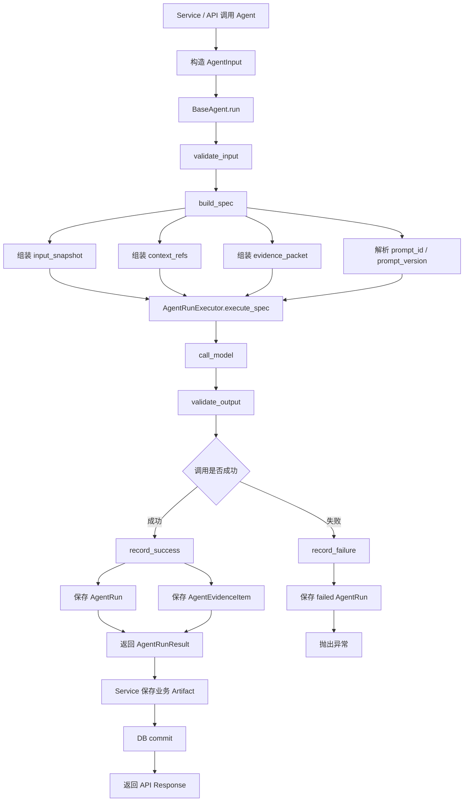

### 2.1 单次 Agent Run 的边界

单次 Agent Run 负责：

```text
输入校验
Prompt Contract 校验
EvidencePacket 校验
LLM 调用
输出校验
AgentRun 记录
EvidenceItem 记录
返回 AgentRunResult
```

单次 Agent Run 不应该负责：

```text
决定整个业务流程下一步走哪里
等待用户输入
跨多个 Agent 编排
长流程恢复
Human Review 中断
多步骤事务补偿
```

这些应该交给 Workflow 层，未来可由 LangGraph 承载。

---

## 3. LangGraph 接入后的目标分层

目标不是把所有东西都塞进 LangGraph，而是形成清晰分层：

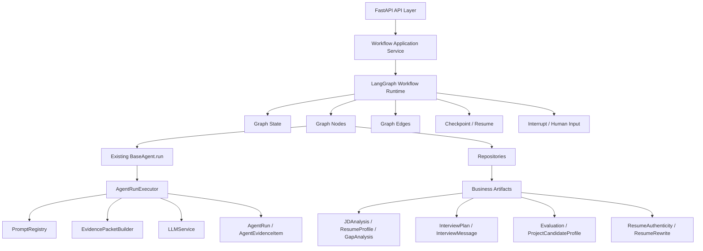

LangGraph 应该新增的是：

```text
Graph State
Node 编排
Edge 条件路由
Checkpoint
Resume
Interrupt
Workflow-level retry / recovery
```

现有系统应该保留的是：

```text
BaseAgent
AgentRunExecutor
PromptRegistry
Prompt Contract
EvidencePacketBuilder
AgentRun
AgentEvidenceItem
业务 Repository
业务 Artifact 表
```

---

## 4. Workflow Lifecycle 总览

系统可以拆成四条主要 Workflow。

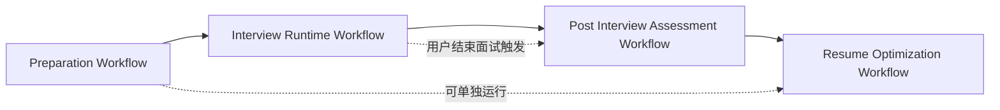

四条 Workflow 分别是：

```text
Preparation Workflow:
  JD / Resume / Gap / InterviewPlan

Interview Runtime Workflow:
  面试开始、多轮问答、话题判断、记忆刷新、追问、等待用户

Post Interview Assessment Workflow:
  最终评价、项目级候选人画像、简历真实性报告

Resume Optimization Workflow:
  简历真实性检查、简历重写
```

---

## 5. Preparation Workflow 生命周期

### 5.1 当前生命周期

当前主要由 `PreparationService` 程序式编排。

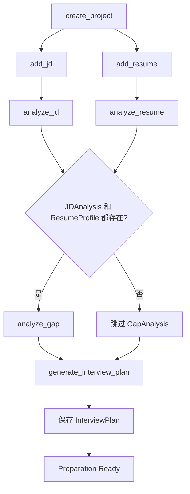

### 5.2 目标 LangGraph 生命周期

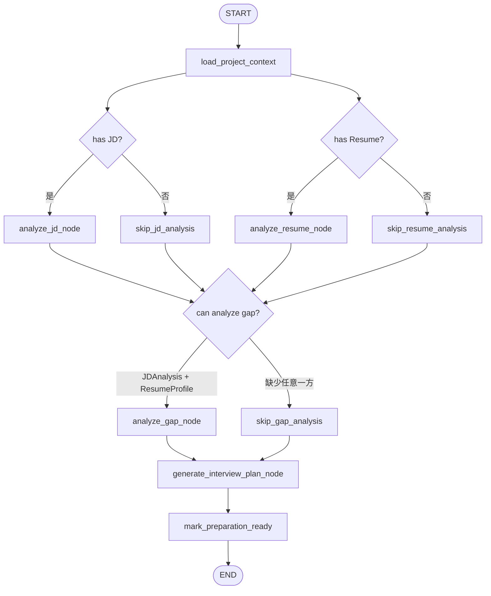

### 5.3 Preparation State

```python
class PreparationState(TypedDict, total=False):
    workflow_id: str
    workflow_run_id: str
    project_id: int
    status: str

    jd_id: int | None
    resume_id: int | None

    jd_analysis_id: int | None
    resume_profile_id: int | None
    gap_analysis_id: int | None
    interview_plan_id: int | None

    plan_mode: str | None

    completed_steps: list[str]
    failed_steps: list[str]
    last_agent_run_id: int | None
    last_error: dict | None
```

### 5.4 Preparation Node 列表

```text
load_project_context
analyze_jd_node
analyze_resume_node
analyze_gap_node
generate_interview_plan_node
mark_preparation_ready
```

### 5.5 Preparation 恢复点

```text
如果 jd_analysis_id 存在：
  不重复运行 JDAnalysisAgent。

如果 resume_profile_id 存在：
  不重复运行 ResumeAnalysisAgent。

如果 gap_analysis_id 缺失，但 jd_analysis_id 和 resume_profile_id 都存在：
  从 analyze_gap_node 继续。

如果 interview_plan_id 缺失：
  从 generate_interview_plan_node 继续。
```

---

## 6. Interview Runtime Workflow 生命周期

这条 Workflow 是最适合优先迁移 LangGraph 的，因为它天然具备：

```text
多轮
状态持续变化
用户输入中断
条件路由
LLM 失败恢复
面试执行状态恢复
```

### 6.1 当前生命周期

当前主要由 `InterviewService.start_with_project()` 和 `InterviewService.chat()` 编排。

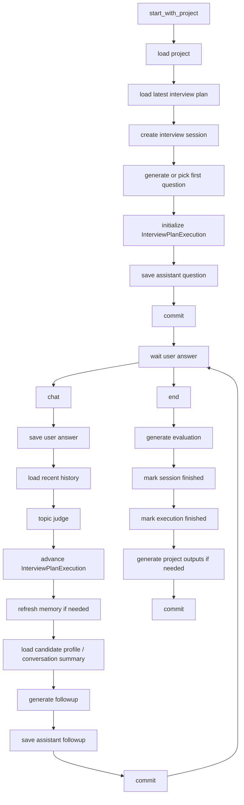

### 6.2 目标 LangGraph 生命周期

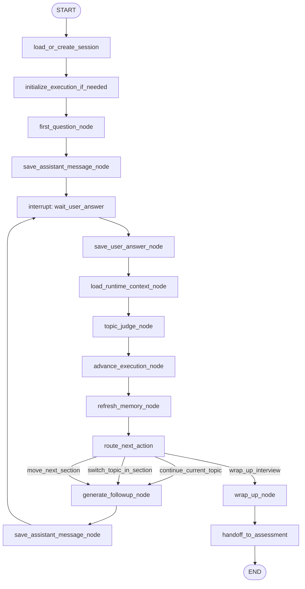

### 6.3 Interview Runtime State

```python
class InterviewRuntimeState(TypedDict, total=False):
    workflow_id: str
    workflow_run_id: str
    project_id: int | None
    session_id: int
    session_uid: str
    status: str

    interview_plan_id: int | None
    execution_id: int | None

    current_section_key: str | None
    current_section_index: int
    current_section_round_no: int
    total_completed_round_no: int
    next_action: str | None

    last_user_message_id: int | None
    last_assistant_message_id: int | None
    last_topic_judge_agent_run_id: int | None

    latest_candidate_memory_id: int | None
    latest_conversation_summary_id: int | None

    waiting_for_user: bool
    user_input: str | None

    completed_steps: list[str]
    failed_steps: list[str]
    last_agent_run_id: int | None
    last_error: dict | None
```

### 6.4 Interview Runtime Node 列表

```text
load_or_create_session
initialize_execution_if_needed
first_question_node
save_assistant_message_node
wait_user_answer
save_user_answer_node
load_runtime_context_node
topic_judge_node
advance_execution_node
refresh_memory_node
route_next_action
generate_followup_node
wrap_up_node
handoff_to_assessment
```

### 6.5 Interview Runtime 恢复点

```text
场景 A：assistant question 已保存，正在等用户回答
  恢复到 wait_user_answer。
  前端继续展示最后一条 assistant message。

场景 B：用户 answer 已保存，但 topic judge 没完成
  从 topic_judge_node 继续。

场景 C：topic judge 已完成，但 execution 没推进
  从 last_topic_judge_agent_run_id 读取 output_snapshot。
  从 advance_execution_node 继续。

场景 D：execution 已推进，但 followup 没生成
  从 generate_followup_node 继续。

场景 E：followup AgentRun 已成功，但 assistant message 没保存
  用 AgentRun.output_snapshot 补写 assistant message。
  不重新调用 LLM。

场景 F：assistant followup 已保存
  恢复到 wait_user_answer。
```

### 6.6 Interview Runtime 幂等键

建议每个有副作用的 Node 使用稳定幂等键。

```text
save_user_answer_node:
  session_id + round_no + role_type=user

topic_judge_node:
  workflow_run_id + step_id=topic_completion_judge + answer_message_id

advance_execution_node:
  execution_id + answer_message_id

generate_followup_node:
  workflow_run_id + step_id=followup + answer_message_id

save_assistant_message_node:
  session_id + round_no + role_type=assistant
```

---

## 7. Post Interview Assessment Workflow 生命周期

### 7.1 当前生命周期

当前主要由 `InterviewService.end()` 和 `_generate_project_outputs_if_needed()` 编排。

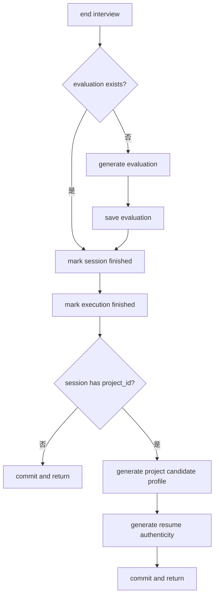

### 7.2 目标 LangGraph 生命周期

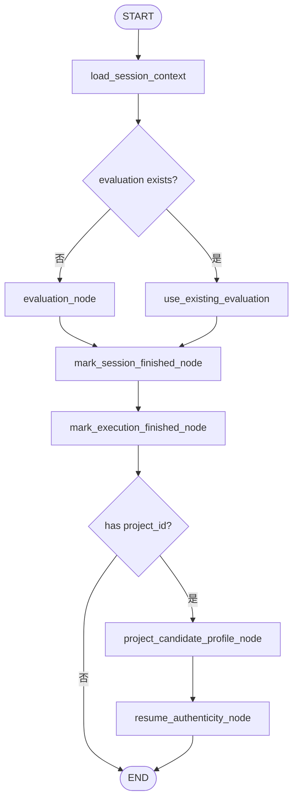

### 7.3 Assessment State

```python
class AssessmentState(TypedDict, total=False):
    workflow_id: str
    workflow_run_id: str
    project_id: int | None
    session_id: int
    status: str

    evaluation_id: int | None
    project_candidate_profile_id: int | None
    resume_authenticity_report_id: int | None

    completed_steps: list[str]
    failed_steps: list[str]
    last_agent_run_id: int | None
    last_error: dict | None
```

### 7.4 Assessment Node 列表

```text
load_session_context
evaluation_node
mark_session_finished_node
mark_execution_finished_node
project_candidate_profile_node
resume_authenticity_node
```

### 7.5 Assessment 恢复点

```text
如果 evaluation_id 存在：
  不重复生成 evaluation。

如果 session.status 不是 finished：
  补 mark_session_finished_node。

如果 execution.status 不是 finished：
  补 mark_execution_finished_node。

如果 project_candidate_profile_id 缺失：
  从 project_candidate_profile_node 继续。

如果 resume_authenticity_report_id 缺失：
  从 resume_authenticity_node 继续。
```

---

## 8. Resume Optimization Workflow 生命周期

### 8.1 当前生命周期

当前主要由 `PreparationService.rewrite_resume()` 编排。

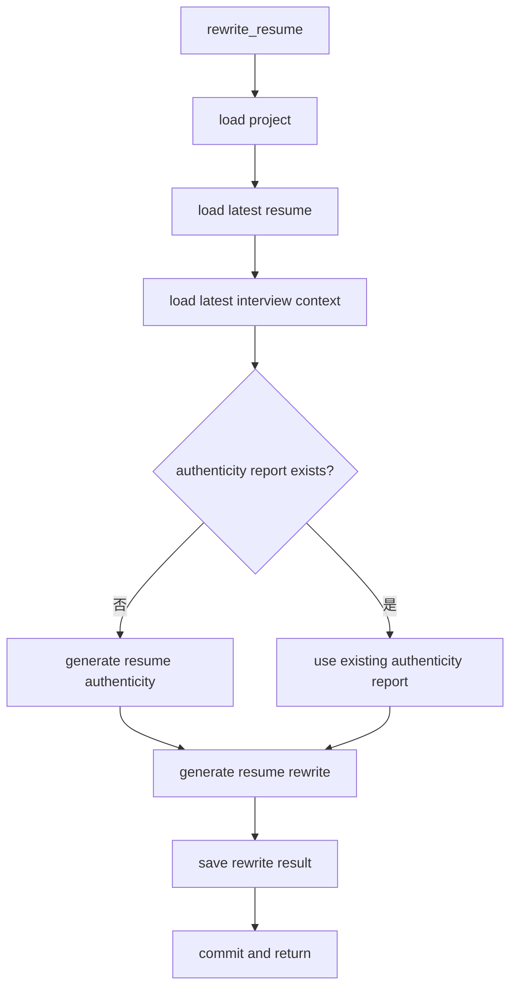

### 8.2 目标 LangGraph 生命周期

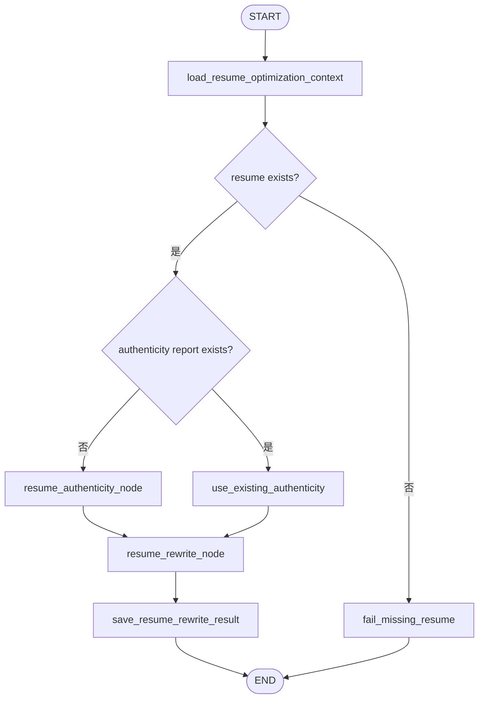

### 8.3 Resume Optimization State

```python
class ResumeOptimizationState(TypedDict, total=False):
    workflow_id: str
    workflow_run_id: str
    project_id: int
    status: str

    resume_id: int | None
    session_id: int | None

    resume_authenticity_report_id: int | None
    resume_rewrite_result_id: int | None
    rewrite_mode: str

    completed_steps: list[str]
    failed_steps: list[str]
    last_agent_run_id: int | None
    last_error: dict | None
```

### 8.4 Resume Optimization Node 列表

```text
load_resume_optimization_context
resume_authenticity_node
resume_rewrite_node
save_resume_rewrite_result
fail_missing_resume
```

### 8.5 Resume Optimization 恢复点

```text
如果 authenticity_report_id 存在：
  不重复生成真实性报告。

如果 resume_rewrite_result_id 存在：
  直接返回已有重写结果。

如果 resume_authenticity AgentRun 成功但 artifact 没保存：
  用 AgentRun.output_snapshot 补写 authenticity artifact。

如果 resume_rewrite AgentRun 成功但 artifact 没保存：
  用 AgentRun.output_snapshot 补写 rewrite artifact。
```

---

## 9. State / Context / Artifact / Evidence 边界

### 9.1 判断 State 的标准

一个字段应该进入 State，通常需要满足以下条件之一：

```text
程序停了以后，需要靠它知道下一步从哪里继续。
它会影响 Edge 路由。
多个 Node 都需要读写它。
它是当前 Workflow 的运行游标。
它需要被 checkpoint。
它比较小，适合 JSON 序列化。
```

### 9.2 不建议放进 State 的内容

```text
完整 JD 原文
完整简历原文
完整对话历史
完整 LLM raw_response
完整大 JSON artifact
大型 evidence_packet
```

这些内容应该继续放在业务表或 AgentRun 里，State 只保存引用：

```text
jd_id
resume_id
message_id
agent_run_id
evaluation_id
candidate_profile_id
evidence_refs
```

### 9.3 推荐分层

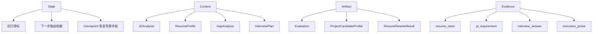

---

## 10. Node / Middleware / Tool 边界

### 10.1 Node

Node 是 Workflow 图上的业务步骤。

判断标准：

```text
它有明确输入输出。
它可能改变 Workflow State。
它失败后需要单独恢复。
它有业务含义。
它应该出现在流程图上。
```

适合作为 Node：

```text
analyze_jd_node
analyze_resume_node
topic_judge_node
advance_execution_node
generate_followup_node
evaluation_node
resume_rewrite_node
```

不适合作为 Node：

```text
_current_probe_point
_plan_context
_evaluation_to_response
_validation_errors
```

### 10.2 Middleware

Middleware 是横切逻辑。

适合作为 Middleware：

```text
AgentRun 记录
Prompt Contract 校验
EvidencePacket 校验
输入输出 Schema 校验
LLM retry / timeout / fallback
Guardrails
日志 / trace / token / cost
幂等检查
Human Review policy
```

不适合作为 Middleware：

```text
生成面试计划
生成追问
推进面试 section
生成最终评价
生成简历重写
```

### 10.3 Tool

Tool 是模型可以根据语义选择调用的能力。

适合作为 Tool：

```text
get_current_interview_plan_section
search_interview_evidence
get_resume_claims
get_jd_requirements
retrieve_question_bank
lookup_project_candidate_profile
check_claim_support
```

不建议作为 Tool：

```text
save_message
create_evaluation
mark_session_finished
update_execution_state
create_resume_rewrite_result
```

原因：

```text
写库和状态推进应该由 Graph Node 稳定控制，不应该交给模型自由决定。
```

---

## 11. 程序中断后的恢复策略

### 11.1 恢复原则

```text
恢复到最后一个成功提交的业务边界之后。
```

恢复时不要只相信 checkpoint，也不要只相信 DB。应该对账：

```text
Checkpoint:
  说明 Graph 认为自己走到了哪里。

DB Artifact:
  说明副作用是否真的提交成功。

AgentRun:
  说明某次 LLM 调用是否已经成功完成。
```

### 11.2 恢复决策顺序

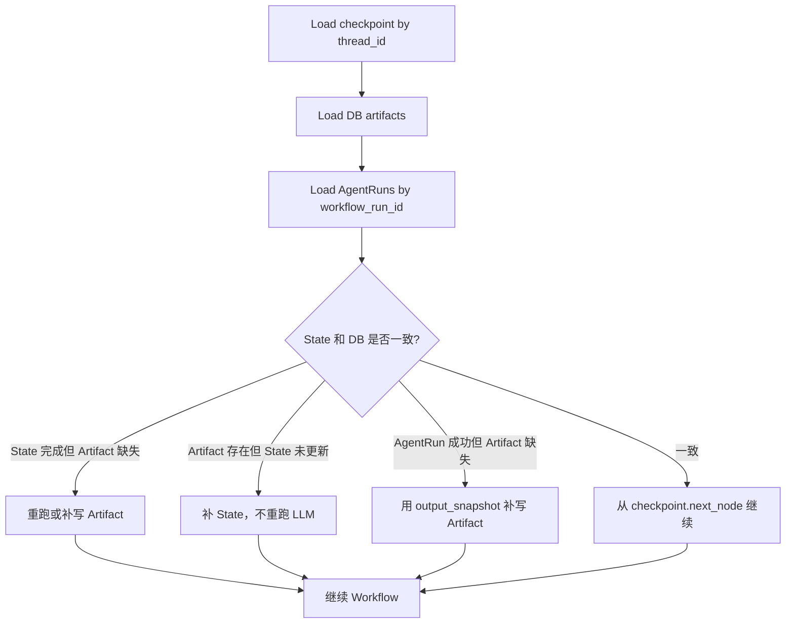

### 11.3 推荐 thread_id

```text
Preparation:
  preparation:{project_uid}:{workflow_run_id}

Interview Runtime:
  interview:{session_uid}

Post Interview Assessment:
  assessment:{session_uid}:{workflow_run_id}

Resume Optimization:
  resume_optimization:{project_uid}:{workflow_run_id}
```

---

## 12. 推荐迁移顺序

### P0：只画生命周期，不接 LangGraph

交付物：

```text
4 条 Workflow 图
每条 Workflow 的 State schema
每条 Workflow 的 Node 列表
每条 Edge 的路由条件
每个 Node 的幂等键
恢复策略
```

### P1：优先迁移 Interview Runtime

原因：

```text
多轮
等待用户输入
状态持续变化
最需要 checkpoint / resume
```

### P2：迁移 Resume Optimization

原因：

```text
流程短
证据约束强
适合验证 AgentRun + Artifact 补写恢复
```

### P3：迁移 Post Interview Assessment

原因：

```text
当前后置产物生成是 best-effort warning。
迁移后可以明确 partial / failed / retry。
```

### P4：最后迁移 Preparation

原因：

```text
Preparation 相对线性。
当前 Service 编排短期还能支撑。
```

---

## 13. 最终目标生命周期

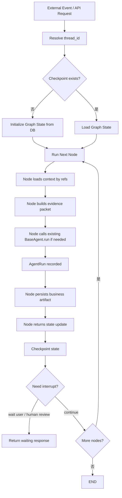

一句话总结：

```text
现有 AgentRun 生命周期继续保留。
LangGraph 负责把多个 AgentRun 和业务副作用组织成可恢复的 Workflow 生命周期。
```
