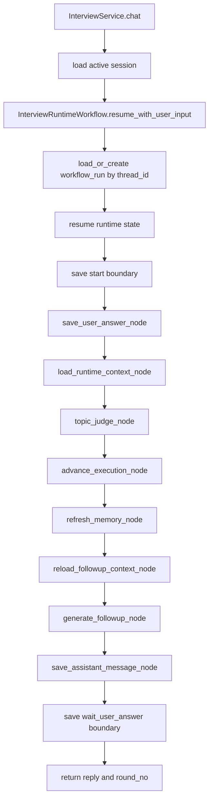

# Interview Runtime LangGraph Design

本文档记录 Interview Runtime 从顺序 `InterviewService.chat()` 迁移到可恢复 Workflow / LangGraph 架构的当前设计。

目标不是“为了接 LangGraph 而接 LangGraph”，而是先把面试运行时拆成稳定的 State、Node、Workflow、恢复语义和观测链路。LangGraph 在当前阶段是可选执行引擎，业务语义仍由我们自己的 runtime nodes 和 workflow state 承载。

---

## 1. 为什么迁移

原始 `InterviewService.chat()` 把多种职责混在同一个顺序方法里：

```text
save user answer
load recent history
judge topic completion
advance interview execution
refresh memory summaries
generate followup
save assistant message
commit
```

这在正常路径上可以工作，但一旦中途失败或进程停止，会出现几个问题：

```text
1. 不知道停在了哪个业务边界。
2. user answer 已保存但 followup 没生成时，恢复语义不清楚。
3. TopicJudge 成功但 execution 没推进时，容易重复调用或重复推进。
4. Followup AgentRun 成功但 assistant message 没保存时，可能重复调用 LLM。
5. Memory refresh 是 best-effort，但失败信息不容易被观察。
6. 未来加入 LangGraph、retry、human review、streaming 后，chat() 会继续膨胀。
```

迁移收益：

```text
1. 每一步有明确 Node 边界。
2. 每轮面试有 workflow_run_id。
3. workflow_runs.state 可以持久化和恢复。
4. AgentRun 可以归属到同一个 workflow_run_id。
5. blocking failure 可以落到 workflow_runs.status = failed。
6. 查询接口可以看到 currentStep / activeStep / resumeReason / errorMessage。
7. sequential runtime 和 LangGraph runtime 可以共享同一套业务节点。
```

---

## 2. 当前落地范围

当前优先迁移的是 chat loop，不完整迁移 start/end/evaluation。

已落地：

```text
InterviewService.chat()
-> InterviewRuntimeWorkflow
-> sequential runtime 或 LangGraph runtime
-> InterviewRuntimeNodes
-> workflow_runs state save/resume
-> AgentRun workflow_context.workflow_run_id 对齐
-> WorkflowRunQueryService 查询可观测
```

暂不迁移：

```text
start_with_project()
end()
evaluation
project candidate profile
resume authenticity
resume rewrite
```

这些后续可以成为独立 workflow：

```text
post_interview_assessment
resume_optimization
preparation
```

---

## 3. 当前代码结构

核心文件：

```text
backend/app/service/interview_runtime_state.py
  InterviewRuntimeState
  RuntimeContext

backend/app/service/interview_runtime_nodes.py
  save_user_answer_node
  load_runtime_context_node
  topic_judge_node
  advance_execution_node
  refresh_memory_node
  reload_followup_context_node
  generate_followup_node
  save_assistant_message_node

backend/app/service/interview_runtime_resume.py
  resume_interview_runtime_state

backend/app/service/interview_runtime_workflow.py
  InterviewRuntimeWorkflow
  sequential runtime facade
  failure handling

backend/app/service/interview_runtime_langgraph.py
  optional LangGraph StateGraph wrapper

backend/app/service/workflow_runtime.py
  load_or_create workflow_run
  save workflow_run state

backend/app/service/workflow_run_query_service.py
  workflow run list/detail
  persisted workflow_runs first
  legacy AgentRun grouping fallback
```

数据表：

```text
workflow_runs
agent_runs
agent_evidence_items
interview_messages
interview_plan_executions
interview_summaries
```

---

## 4. Runtime Lifecycle

当前 chat loop 生命周期：



每个边界会保存：

```text
workflow_runs.status
workflow_runs.current_step
workflow_runs.state
workflow_runs.last_error
workflow_runs.error_message
```

---

## 5. State 设计

`InterviewRuntimeState` 是 workflow 运行游标，不是完整上下文容器。

当前关键字段：

```python
class InterviewRuntimeState(TypedDict, total=False):
    workflow_id: str
    workflow_run_id: str
    thread_id: str
    status: str
    active_step: str | None

    project_id: int | None
    session_id: int
    session_uid: str
    role_name: str
    interview_plan_id: int | None

    execution_id: int | None
    current_section_key: str | None
    current_section_index: int
    current_section_round_no: int
    total_completed_round_no: int
    next_action: str | None

    incoming_user_input: str | None
    expected_user_round_no: int | None

    last_user_message_id: int | None
    last_assistant_message_id: int | None

    last_topic_judge_agent_run_id: int | None
    last_followup_agent_run_id: int | None
    last_memory_agent_run_ids: list[int]
    last_agent_run_id: int | None

    latest_candidate_memory_id: int | None
    latest_conversation_summary_id: int | None

    completed_steps: list[str]
    failed_steps: list[str]
    last_error: dict | None

    resume_reason: str | None
    resume_from_step: str | None
```

进入 State 的标准：

```text
1. 恢复时需要它判断下一步。
2. 多个 node 需要共享它。
3. 它影响 workflow 状态或路由。
4. 它足够小，适合 JSON 持久化。
5. 它是业务 artifact / AgentRun / message 的引用 ID，而不是完整内容。
```

不进入 State：

```text
完整 transcript
完整 recent_history
完整 InterviewPlan content
完整 InterviewPlanExecution.state
完整 candidate_profile content
完整 conversation_summary content
完整 LLM raw_response
完整 evidence_packet
```

这些内容按需从 DB / AgentRun 读取。

---

## 6. Node 设计

当前 Node 是普通 Python 方法，不依赖 LangGraph。LangGraph wrapper 只是把这些方法注册进图里。

### 6.1 save_user_answer_node

职责：

```text
把外部用户输入保存为 interview_messages(user/answer)。
```

幂等键：

```text
session_id + round_no + role_type=user + message_type=answer
```

恢复规则：

```text
如果同 round user answer 已存在：
  复用 existing message
  写入 last_user_message_id
  completed_steps += save_user_answer_reused
```

### 6.2 load_runtime_context_node

职责：

```text
加载后续节点需要的上下文引用和临时对象。
```

读取：

```text
recent_history
active execution
latest candidate_profile summary
latest conversation summary
interview plan
```

恢复规则：

```text
无写副作用，可随时重跑。
```

### 6.3 topic_judge_node

职责：

```text
调用 TopicJudgeAgent 判断当前回答是否覆盖当前 topic / probe point。
```

幂等键：

```text
session_id + prompt_id=topic_completion_judge + context_refs(answer_message_id, execution_id)
```

恢复规则：

```text
如果同 answer_message_id + execution_id 已有成功 AgentRun：
  复用 output_snapshot
  不重复调用 LLM
```

失败语义：

```text
non-blocking failure
记录 failed_steps / last_error
返回 judge_result = None
主流程继续 advance_execution_node
```

### 6.4 advance_execution_node

职责：

```text
推进 InterviewPlanExecution.state。
```

幂等键：

```text
execution_id + answer_message_id
```

恢复规则：

```text
如果 execution.state.sections[].evidence 已包含 answer_message_id：
  不重复调用 advance_after_answer
  不重复增加 completed round
  completed_steps += advance_execution_reused
```

### 6.5 refresh_memory_node

职责：

```text
按轮次刷新 candidate_profile summary / conversation summary。
```

幂等键：

```text
session_id + summary_type + from_round_no + to_round_no
```

失败语义：

```text
non-blocking failure
memory 失败不阻断面试主流程
记录 failed_steps / last_error 后继续 generate_followup_node
```

### 6.6 reload_followup_context_node

职责：

```text
在 execution/memory 可能变化后重新加载 followup 所需上下文。
```

恢复规则：

```text
无写副作用，可随时重跑。
```

### 6.7 generate_followup_node

职责：

```text
调用 InterviewExecutorAgent 生成下一问。
```

幂等键：

```text
session_id + prompt_id=followup + context_refs(answer_message_id)
```

恢复规则：

```text
如果同 answer_message_id 已有成功 followup AgentRun：
  复用 output_snapshot
  不重复调用 LLM
```

失败语义：

```text
blocking failure
workflow_runs.status = failed
workflow_runs.current_step = generate_followup
workflow_runs.last_error = error detail
异常继续抛给 API
```

### 6.8 save_assistant_message_node

职责：

```text
把 followup 结果保存为 interview_messages(assistant/followup)。
```

幂等键：

```text
session_id + round_no + role_type=assistant
```

恢复规则：

```text
如果 assistant message 已存在：
  复用 existing message
  completed_steps += save_assistant_message_reused
```

---

## 7. WorkflowRun 持久化

`WorkflowRuntime.load_or_create(...)` 根据 thread_id 读取或创建 workflow run。

当前 thread_id：

```text
interview:{session_uid}
```

workflow_run_id：

```text
interview_runtime_{uuid}
```

每个边界保存：

```text
start
save_user_answer
load_runtime_context
topic_judge
advance_execution
refresh_memory
reload_followup_context
generate_followup
wait_user_answer
```

保存内容：

```text
workflow_id
thread_id
workflow_run_id
status
current_step
state
last_error
error_message
```

状态含义：

```text
running:
  正在执行某一轮 chat，可能停在中间节点。

waiting_user:
  本轮已完成，assistant followup 已保存，等待下一次用户输入。

failed:
  blocking node 失败，本轮未完成，可以基于旧 incoming_user_input 重试。
```

---

## 8. 恢复策略

当前恢复策略是保守版本：不直接从中间节点跳转，而是从本轮 start 重跑，并依赖节点幂等逻辑跳过已经完成的副作用。

这样做的原因：

```text
1. 业务副作用分散在 DB / AgentRun / execution state 中。
2. 只信 checkpoint 可能不准确，必须和 DB artifact 对账。
3. 从 start 重跑简单可靠，风险低。
4. 幂等节点已经可以避免重复写消息、重复推进 execution、重复调用 LLM。
```

### 8.1 waiting_user

含义：

```text
上一轮已经完成，正在等待用户新回答。
```

恢复行为：

```text
使用 API 新传入的 message
resume_reason = new_user_input
resume_from_step = wait_user_answer
清空 completed_steps / failed_steps / last_error
开始新一轮
```

### 8.2 running

含义：

```text
上一轮还在执行中，可能进程停在中间节点。
```

恢复行为：

```text
优先使用 workflow_run.state.incoming_user_input
忽略 API 新传入的 message
resume_reason = unfinished_turn
resume_from_step = workflow_run.current_step
清空 completed_steps / failed_steps / last_error
从 start 重跑
```

### 8.3 failed

含义：

```text
上一轮 blocking node 失败，本轮没有完成。
```

恢复行为：

```text
优先使用 workflow_run.state.incoming_user_input
忽略 API 新传入的 message
resume_reason = failed_retry
resume_from_step = workflow_run.current_step
清空 failed_steps / last_error
从 start 重跑
```

典型场景：

```text
generate_followup failed
user answer 已保存
execution 已推进
assistant message 未保存

下一次重试：
save_user_answer_node 复用 user message
advance_execution_node 复用 execution evidence
generate_followup_node 重新尝试
save_assistant_message_node 成功后进入 waiting_user
```

---

## 9. 失败语义

### 9.1 Non-blocking Failure

适用节点：

```text
topic_judge_node
refresh_memory_node
```

行为：

```text
记录 failed_steps
记录 last_error
主流程继续
最终仍可进入 waiting_user
```

原因：

```text
topic judge 和 memory 是增强质量的步骤，不应该阻断用户继续面试。
```

### 9.2 Blocking Failure

适用节点：

```text
generate_followup_node
save_assistant_message_node
关键 DB 写入节点
```

行为：

```text
workflow_runs.status = failed
workflow_runs.current_step = failed node
workflow_runs.last_error = {
  step_id,
  message,
  error_type
}
state.failed_steps += failed node
异常继续抛给 API
```

当前实现通过 `active_step` 定位失败节点。

---

## 10. LangGraph 当前角色

当前 LangGraph 是可选执行路径：

```text
USE_LANGGRAPH_INTERVIEW_RUNTIME=false
  使用 sequential runtime

USE_LANGGRAPH_INTERVIEW_RUNTIME=true
  使用 InterviewRuntimeLangGraph
```

LangGraph wrapper 做的事情：

```text
1. 定义 StateGraph。
2. 注册 runtime nodes。
3. 按固定边连接 start -> ... -> save_assistant_message -> END。
4. 每个 graph node 调用同一套 InterviewRuntimeNodes。
5. 每个边界保存 workflow_runs.state。
6. 节点失败时保存 workflow_runs.status = failed。
```

LangGraph 当前不承担的事情：

```text
1. 不改变业务节点语义。
2. 不替代 AgentRun / Prompt Contract / EvidencePacket。
3. 暂不依赖 LangGraph checkpoint 作为唯一恢复来源。
4. 暂不做复杂 conditional edge。
5. 暂不迁移 start_with_project / end / evaluation。
```

这意味着：

```text
业务恢复语义先稳定在我们自己的 WorkflowRuntime + workflow_runs.state 上。
LangGraph 后续可以替换执行编排，但不能绕过业务幂等和 DB 对账。
```

---

## 11. workflow_run_id 与 AgentRun 对齐

当前每个 runtime AgentRun 的 workflow_context 会写入真实 workflow_run_id：

```json
{
  "workflow_id": "interview_runtime",
  "workflow_run_id": "interview_runtime_xxx",
  "step_id": "followup"
}
```

来源链路：

```text
workflow_runs.workflow_run_id
-> state["workflow_run_id"]
-> Runtime Agent Input
-> InterviewAgentSpecBuilder.workflow_context
-> AgentRun.input_snapshot.workflow_context
```

收益：

```text
WorkflowRunQueryService 可以用真实 workflow_run_id 找到本轮 topic_judge / followup / memory AgentRun。
```

---

## 12. 查询与可观测性

`WorkflowRunQueryService` 优先读取 persisted `workflow_runs`。

如果没有 persisted workflow_run，则 fallback 到 legacy AgentRun grouping。

列表/详情响应暴露：

```text
workflowRunId
workflowId
threadId
status
currentStep
activeStep
resumeReason
resumeFromStep
completedSteps
failedSteps
errorMessage
agentRunCount
latestAgentRunId
```

详情额外暴露：

```text
state
lastError
steps
agentRuns
```

调试时重点看：

```text
status = waiting_user
  当前没有卡住，正在等用户。

status = running
  上一轮可能中断，下一次请求会 unfinished_turn retry。

status = failed
  blocking node 失败，下一次请求会 failed_retry。

currentStep
  workflow_run 最后保存的边界。

activeStep
  运行中或失败时正在执行的节点。

resumeReason
  本次 state 是新用户输入、未完成重试，还是失败重试。

errorMessage
  blocking failure 的快速摘要。
```

---

## 13. 验收标准

当前阶段应满足：

```text
1. 用户回答保存后程序停止，再次请求不会重复创建 user message。
2. TopicJudge 成功后程序停止，再次请求不会重复调用 TopicJudge。
3. execution 已推进后程序停止，再次请求不会重复 advance execution。
4. Followup AgentRun 成功但 assistant message 未保存时，可以复用 AgentRun 补写 message。
5. Memory refresh 失败不会阻塞面试。
6. generate_followup 失败会把 workflow_run 标记为 failed。
7. failed workflow 再次请求时使用旧 incoming_user_input 重试。
8. workflow_run_id 可以串起 workflow_runs 和 AgentRun。
9. `/workflow-runs/{id}` 可以看到 status/currentStep/activeStep/resumeReason/errorMessage。
10. sequential runtime 和 LangGraph runtime 共享同一套 Node 语义。
11. LangGraph normal path 测试可以验证 waiting_user 和真实 workflow_run_id 传递。
12. LangGraph failed retry 测试可以验证旧 incoming_user_input 被复用。
```

已覆盖测试：

```text
python -m unittest discover -s backend\tests
```

重点测试文件：

```text
backend/tests/service/test_interview_runtime_nodes.py
backend/tests/service/test_workflow_run_query_service.py
backend/tests/service/test_runtime_agents.py
backend/tests/service/test_interview_agent_spec_builder.py
backend/tests/service/test_workflow_runtime.py
```

重点 LangGraph 覆盖：

```text
test_runtime_workflow_can_enable_langgraph_path
  验证 LangGraph path 正常完成一轮 chat，最终进入 waiting_user。
  验证 topic_judge / followup AgentRun input 使用真实 workflow_run_id。

test_langgraph_path_retries_failed_turn_from_persisted_state_when_available
  验证 failed workflow 下一次请求进入 failed_retry。
  验证 retry 使用旧 incoming_user_input，而不是新请求 message。
  验证 save_user_answer / advance_execution 通过幂等逻辑复用旧副作用。
```

---

## 14. 下一步

建议继续按下面顺序推进：

```text
1. 进入 Phase 5：在前端或调试页展示 workflow run 的 activeStep / resumeReason / errorMessage。
2. 前端展示 state / steps / error / AgentRuns，形成可用的 workflow 调试页。
3. 评估是否引入 LangGraph checkpointer，但仍以 DB artifact 对账为准。
4. 增加 conditional edge：wrap_up_interview / continue_current_topic。
5. 再考虑迁移 start_with_project。
6. 最后迁移 end/evaluation 到 post_interview_assessment workflow。
```

核心原则：

```text
先稳定业务恢复语义，再扩大 LangGraph 使用面。
先让状态可见、失败可定位、重试可幂等，再追求更复杂的图编排。
```

相关文档：

```text
docs/phase5_workflow_runtime_design.md
docs/project_build_knowledge_map.md
```
