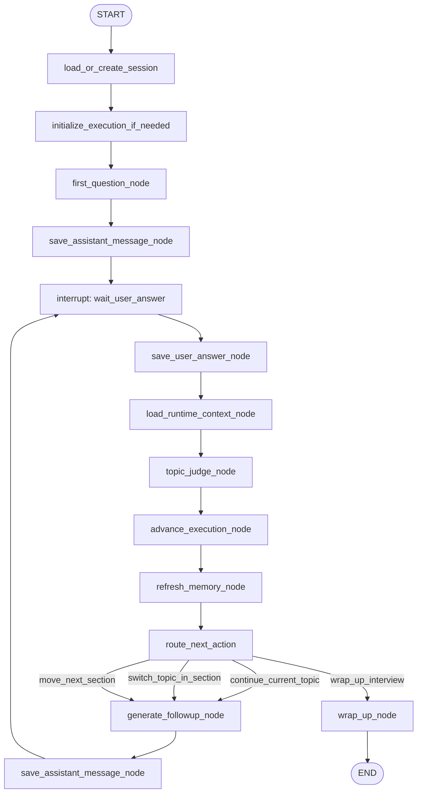

# Interview Runtime LangGraph Design

本文档是 `docs/agent_lifecycle_langgraph.md` 的下一步细化，专门描述 Interview Runtime Workflow 如何迁移到 LangGraph。

目标不是一次性重写所有面试逻辑，而是先把当前 `InterviewService.chat()` 中混在一起的流程拆成可 checkpoint、可恢复、可观察的状态机。

---

## 1. 迁移目标

当前面试运行时逻辑主要集中在：

```text
InterviewService.start_with_project()
InterviewService.chat()
InterviewService.end()
InterviewExecutionService
InterviewExecutorAgent
TopicJudgeAgent
SessionMemoryAgent
EvaluationAgent
```

第一阶段只迁移 runtime loop，不迁移完整 assessment：

```text
start interview
  -> first question
  -> wait user answer

chat loop
  -> save user answer
  -> topic judge
  -> advance execution
  -> refresh memory
  -> generate followup
  -> save assistant message
  -> wait user answer
```

暂不在第一阶段迁移：

```text
end interview
evaluation
project candidate profile
resume authenticity
resume rewrite
```

这些可以作为后续 `post_interview_assessment` graph。

---

## 2. 当前问题

当前 `InterviewService.chat()` 大致做了这些事情：

```text
1. 校验 session active
2. 获取当前 round_no
3. 保存用户回答
4. 查询 recent history
5. 调用 TopicJudgeAgent
6. 推进 InterviewPlanExecution.state
7. 按轮次刷新 candidate memory / conversation summary
8. 加载 summary / plan / execution context
9. 调用 InterviewExecutorAgent 生成 followup
10. 保存 assistant message
11. commit
12. 返回 reply
```

这些步骤目前在一个 service 方法中顺序执行。短期能跑，但有几个问题：

```text
1. 程序中断后，很难准确知道卡在哪一步。
2. 用户回答已经保存但 followup 没生成时，没有统一恢复机制。
3. TopicJudge 成功但 execution 未推进时，需要人工推断。
4. Followup AgentRun 成功但 message 未保存时，可能重复调用 LLM。
5. Memory refresh 是 best-effort，失败后只能写 warning。
6. 未来加入 human review、重试、fallback、streaming 会让 chat() 继续膨胀。
```

LangGraph 要解决的是这些流程编排问题，不是替代现有 Agent。

---

## 3. Graph 总览

### 3.1 Runtime Loop



### 3.2 第一阶段建议

第一阶段可以先只改 `chat()` loop，把 `start_with_project()` 保持原样。

也就是说：

```text
start_with_project()
  仍然由现有 InterviewService 创建 session、execution、first question。

chat()
  改为进入 LangGraph runtime loop。
```

原因：

```text
1. start 流程比较短，当前可控。
2. chat loop 是真正高频、多轮、需要恢复的地方。
3. 先迁移 loop，风险小，收益大。
```

后续再把 `start_with_project()` 也迁进 graph。

---

## 4. State 设计

### 4.1 InterviewRuntimeState

State 只保存恢复和路由必需的运行游标，不保存完整大对象。

```python
from typing import TypedDict


class InterviewRuntimeState(TypedDict, total=False):
    workflow_id: str
    workflow_run_id: str
    thread_id: str
    status: str

    project_id: int | None
    session_id: int
    session_uid: str
    role_name: str

    interview_plan_id: int | None
    execution_id: int | None

    current_section_key: str | None
    current_section_index: int
    current_section_round_no: int
    total_completed_round_no: int
    next_action: str | None

    incoming_user_input: str | None
    expected_user_round_no: int | None

    last_user_message_id: int | None
    last_assistant_message_id: int | None

    last_topic_judge_agent_run_id: int | None
    last_followup_agent_run_id: int | None
    last_memory_agent_run_ids: list[int]

    latest_candidate_memory_id: int | None
    latest_conversation_summary_id: int | None

    completed_steps: list[str]
    failed_steps: list[str]
    last_error: dict | None
```

### 4.2 不进入 State 的内容

以下内容不要放进 State：

```text
完整 transcript
完整 recent_history
完整 InterviewPlan content
完整 InterviewPlanExecution.state
完整 candidate_profile content
完整 conversation_summary content
完整 LLM raw_response
完整 evidence_packet
```

它们应该按需从 DB 读取。State 里只放：

```text
message_id
summary_id
execution_id
agent_run_id
interview_plan_id
```

### 4.3 thread_id

面试 runtime 是一次会话级长线程：

```text
thread_id = interview:{session_uid}
```

原因：

```text
1. 一次 session 对应一条持续多轮的对话运行线。
2. 用户每次 chat 都应该恢复同一条 thread。
3. checkpoint 可以自然表达 wait_user_answer。
```

---

## 5. Node 详细设计

### 5.1 load_or_create_session

第一阶段如果只迁移 `chat()`，这个 node 只需要加载现有 session。

输入：

```text
session_uid
```

读取：

```text
interview_sessions
```

输出 State：

```text
session_id
session_uid
project_id
role_name
interview_plan_id
status
```

失败：

```text
session 不存在 -> terminal failed
session 非 active -> terminal failed 或 route 到 finished response
```

副作用：

```text
无
```

幂等键：

```text
无写入，不需要
```

---

### 5.2 initialize_execution_if_needed

第一阶段通常不会触发，因为 `start_with_project()` 已经初始化 execution。

输入 State：

```text
session_id
interview_plan_id
```

读取：

```text
interview_plan_executions by session_id
interview_plans by interview_plan_id
```

写入：

```text
interview_plan_executions
```

输出 State：

```text
execution_id
current_section_key
current_section_index
current_section_round_no
total_completed_round_no
next_action
```

幂等键：

```text
session_id + interview_plan_id + active execution
```

恢复规则：

```text
如果 active/latest execution 已存在：
  直接加载并写入 State，不重复创建。
```

---

### 5.3 wait_user_answer

这是 interrupt node。

输入 State：

```text
session_id
last_assistant_message_id
expected_user_round_no
```

行为：

```text
暂停 graph，等待 API 用同一个 thread_id 恢复并传入 incoming_user_input。
```

输出 State：

```text
status = waiting_user
```

副作用：

```text
无
```

恢复规则：

```text
如果 checkpoint 停在 wait_user_answer：
  前端展示最后一条 assistant message。
  新 user message 到来后 resume。
```

---

### 5.4 save_user_answer_node

负责保存用户回答。

输入 State：

```text
session_id
incoming_user_input
expected_user_round_no
```

读取：

```text
latest assistant question round_no
existing user answer by session_id + round_no
```

写入：

```text
interview_messages
  role_type = user
  message_type = answer
```

输出 State：

```text
last_user_message_id
expected_user_round_no
```

幂等键：

```text
session_id + round_no + role_type=user + message_type=answer
```

恢复规则：

```text
如果 user answer 已存在：
  不重复写入。
  将 existing message id 写入 last_user_message_id。

如果 incoming_user_input 为空：
  回到 wait_user_answer 或 terminal failed。
```

注意：

```text
这里不要调用 LLM。
这个 node 只负责把外部用户输入变成可恢复的业务事实。
```

---

### 5.5 load_runtime_context_node

负责加载后续节点需要的上下文引用，不直接把大内容放入 State。

输入 State：

```text
session_id
last_user_message_id
interview_plan_id
execution_id
```

读取：

```text
recent_history
active/latest execution
latest candidate_profile summary
latest conversation summary
interview plan
```

输出 State：

```text
execution_id
latest_candidate_memory_id
latest_conversation_summary_id
current_section_key
current_section_index
current_section_round_no
total_completed_round_no
next_action
```

副作用：

```text
无
```

恢复规则：

```text
无写入，随时可重跑。
```

---

### 5.6 topic_judge_node

负责调用 `TopicJudgeAgent` 判断当前回答是否覆盖当前 topic/probe point。

输入 State：

```text
session_id
execution_id
last_user_message_id
```

读取：

```text
session
execution
current_section
answer_message
recent_history
```

调用：

```text
TopicJudgeAgent.run(
  TopicJudgeAgentInput(...)
)
```

写入：

```text
agent_runs
agent_evidence_items
```

输出 State：

```text
last_topic_judge_agent_run_id
last_agent_run_id
```

幂等键：

```text
workflow_run_id + step_id=topic_completion_judge + answer_message_id
```

恢复规则：

```text
如果同一 answer_message_id 已有成功的 TopicJudgeAgent AgentRun：
  直接复用 AgentRun.output_snapshot。
  不重复调用 LLM。

如果没有 current_section：
  跳过 topic judge，route 到 wrap_up 或 generate_followup。

如果 TopicJudgeAgent 失败：
  可以记录 failed AgentRun。
  降级策略：judge_result = None，继续 advance_execution_node。
```

降级策略要保留当前行为：

```text
当前代码里 topic judge 失败后会 warning，然后仍然 advance_after_answer(..., judge_result=None)。
第一阶段可以继续这个策略，避免迁移改变用户体验。
```

---

### 5.7 advance_execution_node

负责推进 `InterviewPlanExecution.state`。

输入 State：

```text
execution_id
last_user_message_id
last_topic_judge_agent_run_id
```

读取：

```text
execution
answer_message
topic_judge AgentRun.output_snapshot
```

调用：

```text
InterviewExecutionService.advance_after_answer(...)
```

写入：

```text
interview_plan_executions
```

输出 State：

```text
current_section_key
current_section_index
current_section_round_no
total_completed_round_no
next_action
```

幂等键：

```text
execution_id + answer_message_id
```

当前代码需要补强：

```text
InterviewPlanExecution.state.sections[].evidence 里目前记录 round_no。
建议新增 answer_message_id 或 source_message_id。
这样 advance_execution_node 可以判断某个 answer 是否已经推进过。
```

恢复规则：

```text
如果 execution.state.evidence 中已存在 answer_message_id：
  不重复推进 completed_rounds。
  只从 execution 读取当前状态写回 State。

如果没有 answer_message_id 字段：
  临时用 round_no 判断，但长期不够稳。
```

---

### 5.8 refresh_memory_node

负责按轮次刷新：

```text
candidate_profile summary
conversation summary
```

输入 State：

```text
session_id
last_user_message_id
```

读取：

```text
latest_completed_round_no
latest candidate_profile summary
latest conversation summary
messages between rounds
```

调用：

```text
SessionMemoryAgent.run(prompt_id="candidate_profile")
SessionMemoryAgent.run(prompt_id="conversation_summary")
```

写入：

```text
interview_summaries
agent_runs
agent_evidence_items
```

输出 State：

```text
latest_candidate_memory_id
latest_conversation_summary_id
last_memory_agent_run_ids
```

幂等键：

```text
session_id + summary_type + from_round_no + to_round_no
```

恢复规则：

```text
如果同范围 summary 已存在：
  复用 existing summary。
  不重复调用 LLM。

如果 memory refresh 失败：
  第一阶段保持当前策略，不阻断主流程。
  写入 failed_steps 或 last_error，但继续 generate_followup_node。
```

注意：

```text
refresh_memory_node 是非关键路径。
它失败不应该导致用户无法继续面试。
```

---

### 5.9 route_next_action

负责根据 execution state 决定下一步。

输入 State：

```text
next_action
current_section_key
status
```

路由：

```text
continue_current_topic -> generate_followup_node
switch_topic_in_section -> generate_followup_node
move_next_section -> generate_followup_node
wrap_up_interview -> wrap_up_node
```

副作用：

```text
无
```

恢复规则：

```text
纯路由，可随时重跑。
```

---

### 5.10 generate_followup_node

负责调用 `InterviewExecutorAgent` 生成下一问。

输入 State：

```text
session_id
last_user_message_id
execution_id
latest_candidate_memory_id
latest_conversation_summary_id
interview_plan_id
```

读取：

```text
session
answer_message
recent_history
candidate_profile summary
conversation_summary
plan_context
execution_context
execution
```

调用：

```text
InterviewExecutorAgent.run(
  FollowupAgentInput(...)
)
```

写入：

```text
agent_runs
agent_evidence_items
```

输出 State：

```text
last_followup_agent_run_id
last_agent_run_id
```

幂等键：

```text
workflow_run_id + step_id=followup + answer_message_id
```

恢复规则：

```text
如果同一 answer_message_id 已有成功 followup AgentRun：
  直接复用 output_snapshot。
  不重复调用 LLM。

如果 AgentRun 成功但 assistant message 未保存：
  交给 save_assistant_message_node 补写 message。
```

---

### 5.11 save_assistant_message_node

负责保存 assistant question/followup。

输入 State：

```text
session_id
last_followup_agent_run_id
last_assistant_message_id
expected_user_round_no
```

读取：

```text
followup AgentRun.output_snapshot
latest assistant question round_no
execution response
```

写入：

```text
interview_messages
  role_type = assistant
  message_type = followup 或 question
```

输出 State：

```text
last_assistant_message_id
expected_user_round_no
status = waiting_user
```

幂等键：

```text
session_id + round_no + role_type=assistant
```

恢复规则：

```text
如果 assistant message 已存在：
  直接复用。

如果 followup AgentRun 存在但 message 不存在：
  用 AgentRun.output_snapshot 补写。

如果 followup AgentRun 不存在：
  回到 generate_followup_node。
```

---

### 5.12 wrap_up_node

负责在 runtime loop 中停止继续追问。

输入 State：

```text
session_id
execution_id
next_action
```

行为：

```text
不生成 followup。
返回面试可结束状态。
```

写入：

```text
第一阶段可以不写 session finished。
session finished 仍由 end interview API 控制。
```

输出 State：

```text
status = wrapping_up
```

恢复规则：

```text
如果 checkpoint 停在 wrapping_up：
  前端可以提示用户结束面试或进入 evaluation。
```

---

## 6. Edge 设计

### 6.1 主路由

```python
def route_next_action(state: InterviewRuntimeState) -> str:
    next_action = state.get("next_action")
    if next_action == "wrap_up_interview":
        return "wrap_up_node"
    return "generate_followup_node"
```

### 6.2 Memory 是否刷新

Memory refresh 目前是 node 内部判断，不建议第一阶段拆成复杂 edge。

规则保持当前逻辑：

```text
latest_completed_round_no < 10:
  不刷新

candidate_profile:
  每 10 个 completed round 刷新

conversation_summary:
  每 5 个 completed round 刷新
```

---

## 7. API 入口设计

### 7.1 第一阶段保留原 API

现有 API 不需要改：

```text
POST /api/interview/chat
```

内部从：

```text
InterviewService.chat()
```

改成：

```text
InterviewRuntimeWorkflow.resume_with_user_input(
  session_uid=session_uid,
  message=message,
)
```

### 7.2 thread_id

```python
thread_id = f"interview:{session_uid}"
```

### 7.3 resume 参数

恢复 graph 时传入：

```python
{
    "incoming_user_input": message,
}
```

### 7.4 返回值

保持现有返回：

```text
reply: str
round_no: int
```

Graph 内部可以通过最后保存的 assistant message 得到返回值。

---

## 8. 数据库补强建议

为了让恢复更稳，建议做两个小改动。

### 8.1 execution evidence 增加 answer_message_id

当前 `InterviewExecutionService.advance_after_answer()` 往 section evidence 里写：

```python
{
    "round_no": round_no,
    "answer_excerpt": answer[:300],
    "probe_point": probe_point,
    ...
}
```

建议增加：

```python
{
    "answer_message_id": answer_message.id,
    "topic_judge_agent_run_id": run_result.agent_run.id,
}
```

这样可以幂等判断：

```text
某个 answer_message 是否已经推进过 execution。
```

### 8.2 interview_messages 增加 workflow_run_id / step_id 可选字段

如果不想改表，也可以先放在 raw_response 里：

```json
{
  "workflow": {
    "workflow_id": "interview_runtime",
    "workflow_run_id": "...",
    "step_id": "followup"
  }
}
```

长期建议单独字段，方便查询。

---

## 9. 第一阶段落地切法

### Step 1：不引入 LangGraph，先抽 Node 函数

先把 `InterviewService.chat()` 拆成纯 Python node-style 方法：

```text
save_user_answer_node()
load_runtime_context_node()
topic_judge_node()
advance_execution_node()
refresh_memory_node()
generate_followup_node()
save_assistant_message_node()
```

这一步不改变行为，只改变结构。

收益：

```text
可测试
可单步验证
后续迁移 LangGraph 时只需要把函数挂到 graph
```

### Step 2：补幂等查询

给这些 node 增加“存在则复用”的逻辑：

```text
save_user_answer_node
topic_judge_node
advance_execution_node
refresh_memory_node
generate_followup_node
save_assistant_message_node
```

### Step 3：引入 LangGraph dependency

添加：

```text
langgraph
```

### Step 4：创建 graph wrapper

新增建议文件：

```text
backend/app/service/interview_runtime_graph.py
```

职责：

```text
定义 InterviewRuntimeState
定义 graph nodes
定义 edges
创建 compiled graph
提供 resume_with_user_input()
```

### Step 5：替换 InterviewService.chat()

把 `chat()` 改成调用 graph wrapper。

保留旧实现一段时间：

```text
chat_legacy()
```

可以用 feature flag 控制：

```text
USE_LANGGRAPH_INTERVIEW_RUNTIME=true/false
```

---

## 10. 最小代码结构建议

```text
backend/app/service/
  interview_runtime_state.py
  interview_runtime_nodes.py
  interview_runtime_graph.py
```

### 10.1 interview_runtime_state.py

```text
只放 TypedDict / Pydantic state schema。
```

### 10.2 interview_runtime_nodes.py

```text
放 node 实现。
依赖现有 repository、agent、execution_service。
可以先不依赖 LangGraph。
```

### 10.3 interview_runtime_graph.py

```text
放 LangGraph StateGraph wiring。
把 node 函数注册到 graph。
处理 checkpointer。
处理 thread_id。
提供 service 层调用入口。
```

---

## 11. 验收标准

第一阶段完成后，应该能回答：

```text
1. 用户回答保存后程序挂了，能不能继续生成 followup？
2. TopicJudge 成功后程序挂了，会不会重复调用 TopicJudge？
3. Followup LLM 成功后 message 没保存，会不会重复调用 Followup？
4. Memory refresh 失败会不会阻断面试？
5. 当前 session 正在等待用户，系统如何知道？
6. 每一轮 chat 的 workflow_run_id / step_id / agent_run_id 能否串起来？
```

第一阶段不强求：

```text
完整迁移 start_with_project
完整迁移 end/evaluation
前端展示 graph 状态
复杂 human review
tool calling
```

---

## 12. 推荐结论

Interview Runtime 的迁移应该按这个方向做：

```text
先拆 node，后接 LangGraph。
先补幂等，后做恢复。
先迁移 chat loop，后迁移 start/end。
保留现有 BaseAgent / AgentRun / Evidence / Prompt Contract。
```

最终目标：

```text
InterviewService 不再承担复杂流程编排。
它只负责 API 语义和调用 InterviewRuntimeWorkflow。

InterviewRuntimeWorkflow 负责状态机、checkpoint、resume、interrupt。

现有 Agent 继续负责具体 LLM 能力。
```
